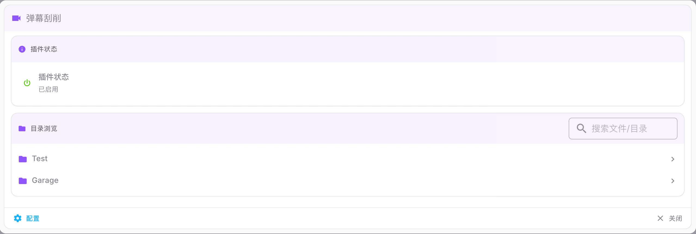
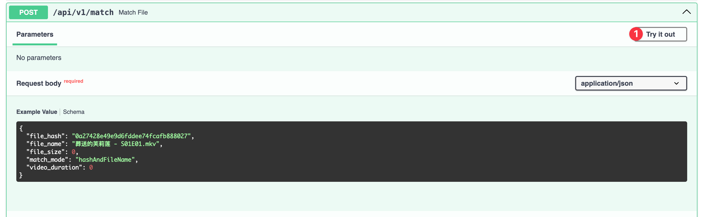
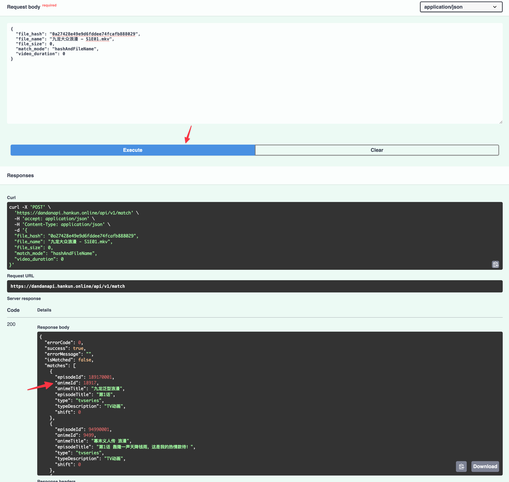

# 弹幕刮削

此插件根据文件匹配弹弹平台上的弹幕,将弹幕文件转换为ass格式字幕,用于实现在不支持弹幕播放的设备上模拟弹幕.

### 文件匹配规则
首先会尝试使用文件hash直接匹配文件,如果没有匹配到怎会尝试使用TMDB ID来进行匹配.
 以上匹配方式可以解决百分之八九十文件的识别问题.
 如果匹配失败,提示找不到对应弹幕,有一个暂时的方法...可以尝试访问 https://dandanapi.hankun.online/docs 

使用try it out,搜索对应文件
 file_hash随便选一个值修改,只要保持长度32位,file_name更改为你想要找的文件然后点execute.在返回的值中找到animeId.

在这个媒体文件的目录中添加一个空白文件,命名为xxxx.id （这个xxxx是你找到的对应的animeId）
之后插件会有限使用这个id来进行弹幕的搜索以及匹配.

### 更新日志

-  v1.4.0: 修复文件路径无法访问的问题,新增无弹幕或者弹幕数量过少时定时重试
-  v1.3.0: 新增联邦组件支持, 增加UI手动刮削, 需求MP v2.4.5+
-  v1.2.0: 针对新番（90天内发布的媒体资源）使用较短时间缓存以获取最新弹幕数据
-  v1.1.15: 增加根据路径刮削弹幕功能。增加单文件路径刮削。能力有限无法在同一个页面实现按钮功能……
-  v1.1.13: 先检查当前目录下有没有.id结尾的文件 如果有，则获取文件名作为弹幕ID（如190270001 则使用19027.id)。如果需要请访问 https://dandanapi.hankun.online/docs 尝试获取epsoide id。
-  v1.1.11: 修复弹幕获取过滤错误
-  v1.1.10: 使用TMDB ID作为预备匹配方案，当无法匹配文件hash时尝试使用TMDB ID。
-  v1.1.8: 增加了中转服务器，恢复了对弹弹的访问以及缓存。修复透明度问题。增加了弹幕过滤选项。
